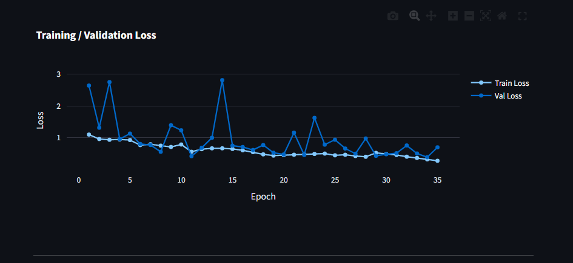
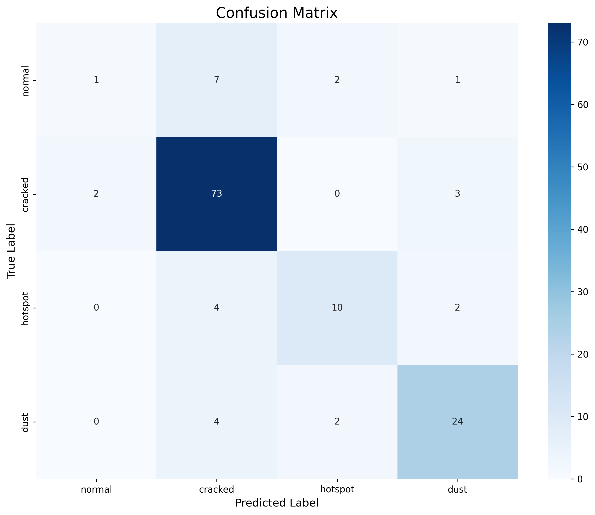
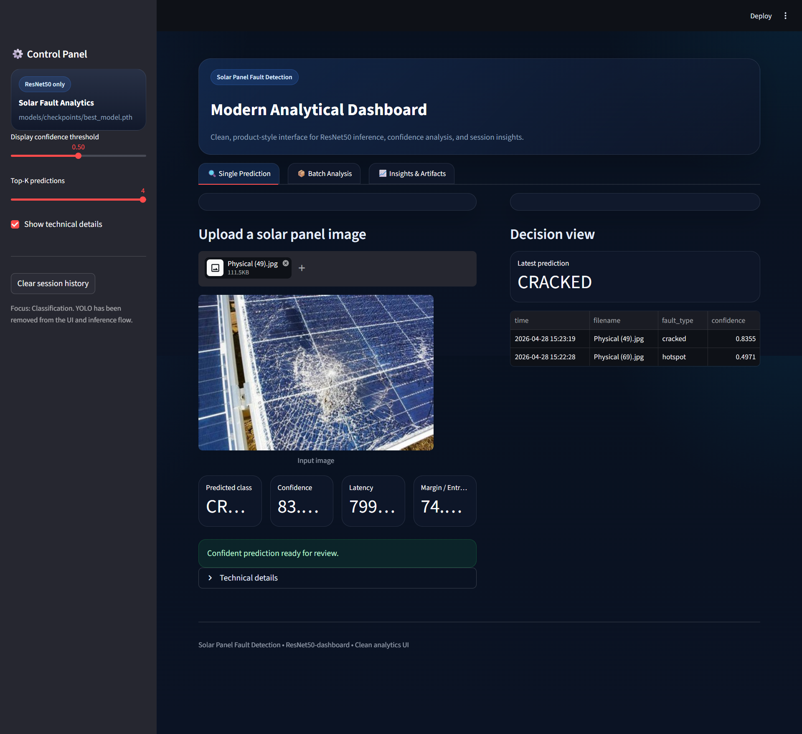
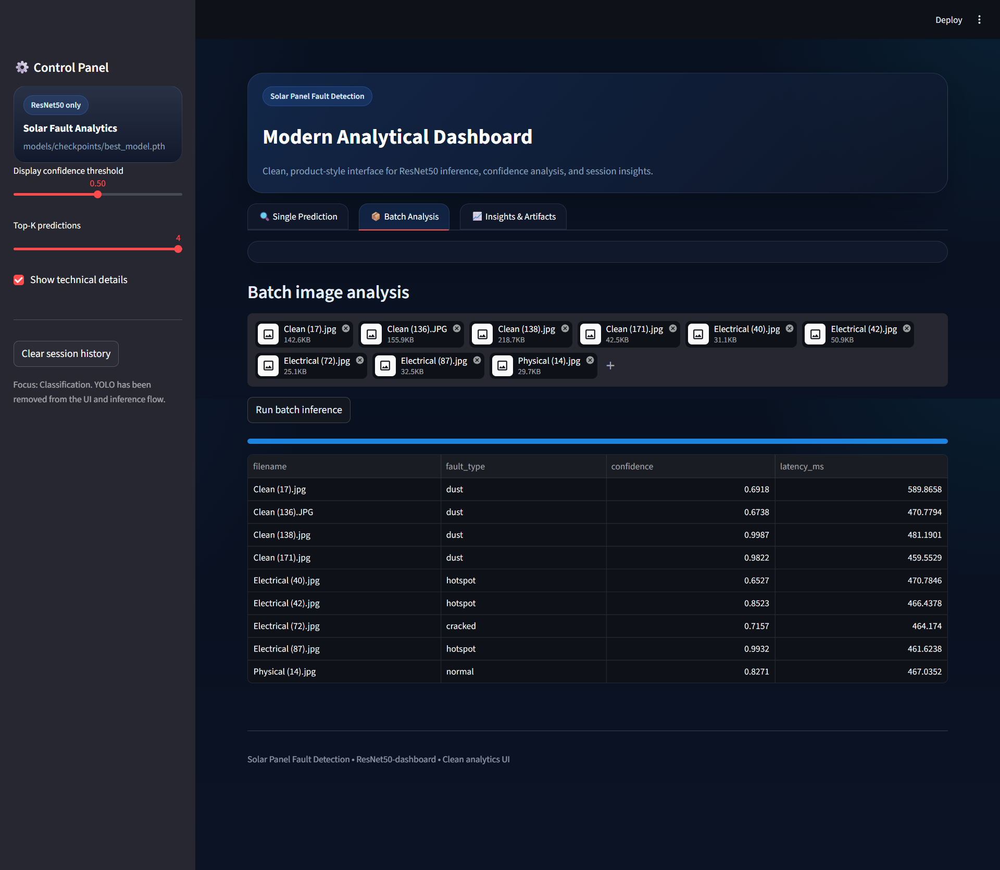
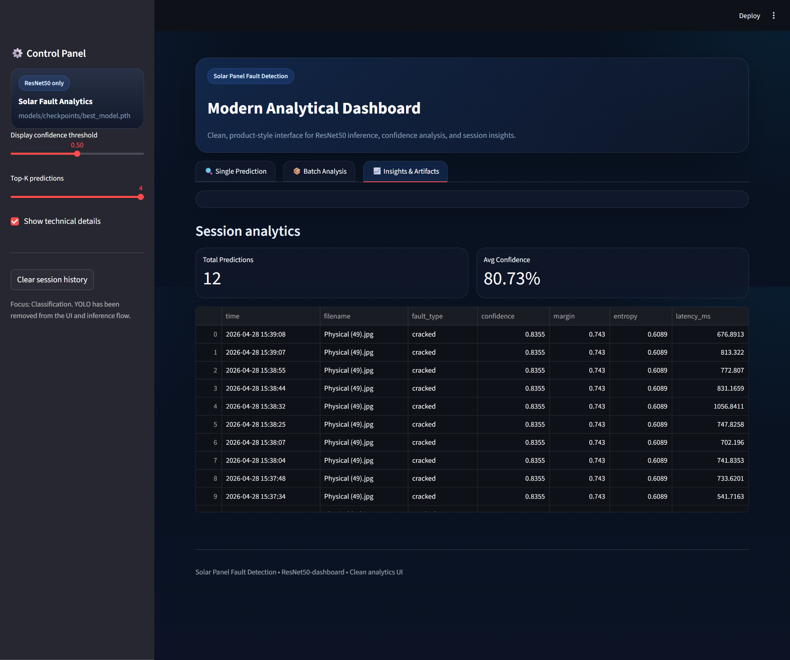

# 🌞 Solar Panel Fault Detection using Deep Learning

A **modern, end-to-end deep learning system** for detecting faults in solar panels using **ResNet50** and a **clean analytical dashboard**.

---

## 🎯 Problem Statement

Solar panels develop faults such as:

* Cracks
* Dust accumulation
* Hotspots

Manual inspection is:

* Time-consuming
* Error-prone

👉 This system automates **fault classification using deep learning**

---

## 🧠 Solution

* ResNet50 (Transfer Learning)
* Image classification (no bounding boxes)
* Real-time predictions
* Analytical dashboard

---

## 🚀 Features

* Multi-class classification:

  * Normal
  * Cracked
  * Hotspot
  * Dust

* Real-time prediction

* Batch image analysis

* Session analytics

* Confidence & probability insights

* Clean modern UI

---

## 🧠 Model Architecture

```
Input Image → ResNet50 → Fully Connected Layer → 4 Classes
```

---

## 📊 Model Performance

* Accuracy: ~88%
* Balanced across classes
* Stable convergence

---

## 📈 Training Curves



---

## 📊 Confusion Matrix



---

# 🖥️ Dashboard

## 🔹 Main Interface



---

## 🔹 Batch Analysis



---

## 🔹 Insights & Analytics



---

# ⚙️ Project Structure

```
solar_panel_fault_detection/
│
├── dashboard/
├── src/
├── models/
├── docs/images/
├── results/
```

---

# 🧪 Installation

```
git clone https://github.com/your-username/solar_panel_fault_detection.git
cd solar_panel_fault_detection
pip install -r requirements.txt
```

---

# ▶️ Run Dashboard

```
streamlit run dashboard/streamlit_app.py
```

---

# 🔬 Tech Stack

* Python
* PyTorch
* ResNet50
* Streamlit
* OpenCV
* Plotly

---

# 🚀 Future Work

* Grad-CAM explainability
* Cloud deployment
* Real-time monitoring

---

# 👨‍💻 Author

Saswat Jena

---

# ⭐ Star this repo if you like it
