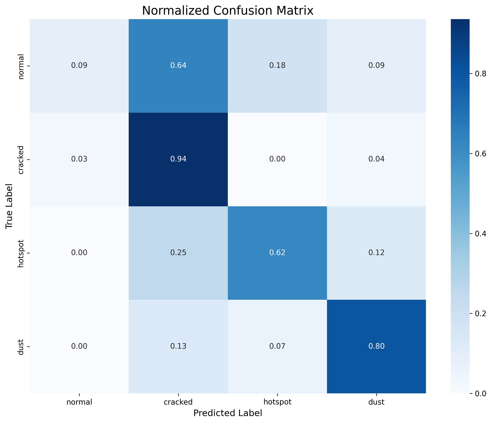
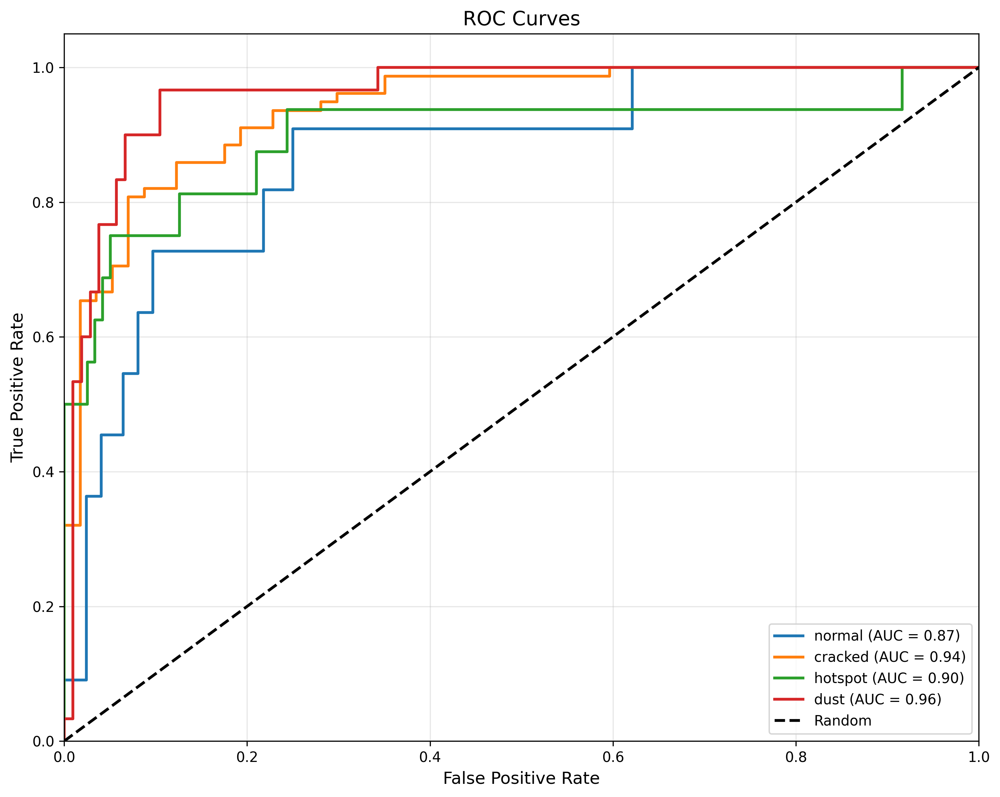
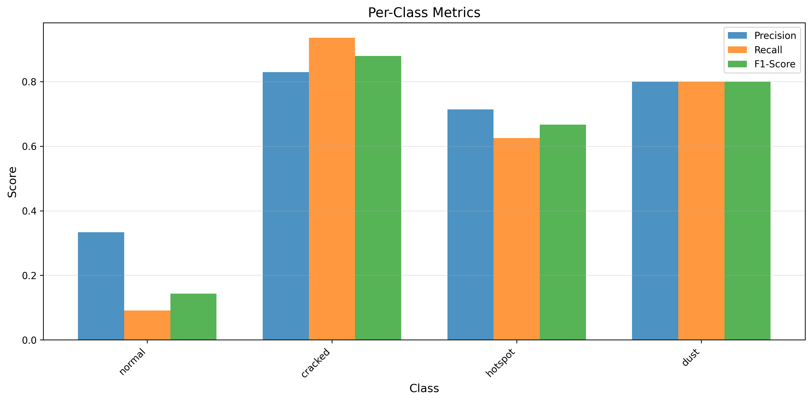
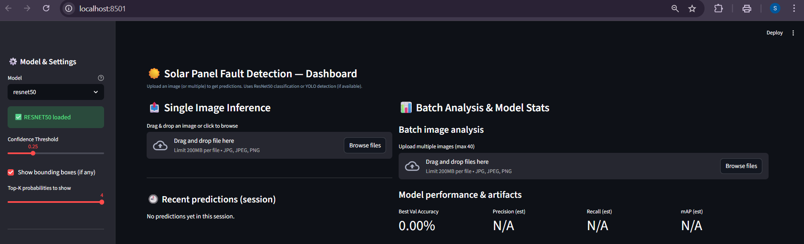
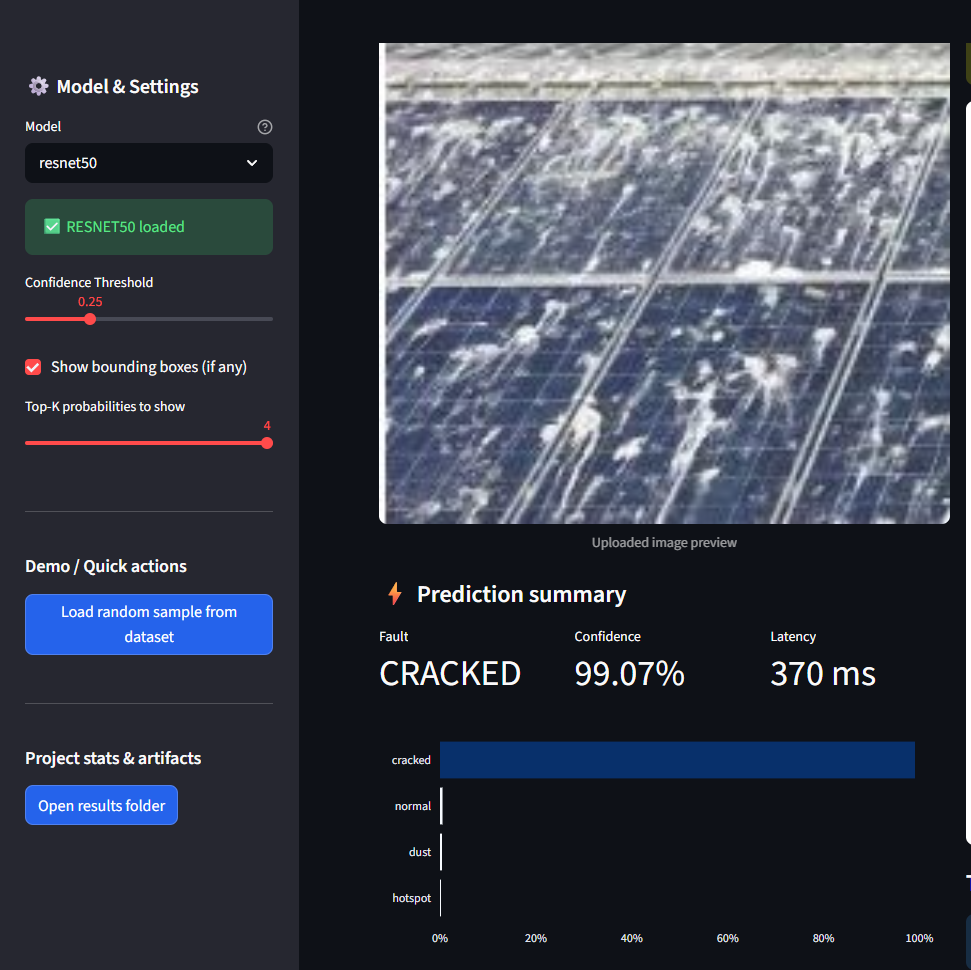
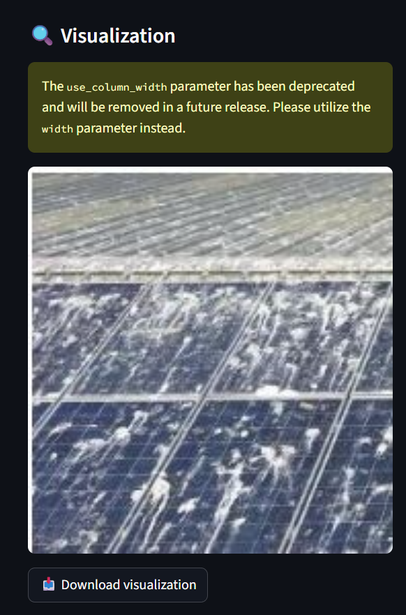

# ☀️ Solar Panel Fault Detection using Deep Learning

An end-to-end **computer vision system** that detects faults in solar panels using deep learning.
The project demonstrates a **complete ML workflow** including dataset preparation, model training, evaluation, inference, API serving, and an interactive dashboard.

This system classifies solar panel images into four categories:

* **Normal**
* **Cracked**
* **Hotspot**
* **Dust**

The project is designed as a **production-style ML project** suitable for **AI / ML Engineering portfolios**.

---

# 🚀 Features

* Deep learning model based on **ResNet50**
* Multi-class classification of solar panel faults
* End-to-end ML pipeline
* Model evaluation with multiple metrics
* Interactive **Streamlit dashboard**
* Real-time **image prediction**
* Batch image analysis
* **FastAPI model serving**
* Docker support for deployment
* Training visualization and performance analysis

---

# 🧠 Model Architecture

The system uses a **transfer learning approach** with **ResNet50** pretrained on ImageNet.

Pipeline:

Dataset → Preprocessing → Data Augmentation → Model Training → Evaluation → Deployment

Model output classes:

* Normal
* Cracked
* Hotspot
* Dust

---

# 📊 Training Curves

Training and validation loss across epochs.


The curves show stable convergence with reduced training loss over time.

---

# 📈 Model Evaluation

## Confusion Matrix


Shows the classification counts for each class.

---

## Normalized Confusion Matrix



Displays percentage-based classification performance.

---

## ROC Curves



Illustrates the model's ability to distinguish between classes.

---

## Per-Class Performance



Shows precision, recall, and F1 score for each fault category.

---

# 🖥️ Interactive Dashboard

The project includes a **modern Streamlit dashboard** for real-time inference.

## Dashboard Interface



Users can:

* Upload solar panel images
* Run model predictions
* Adjust confidence thresholds
* Visualize results interactively

---

# 🔍 Prediction Example

Example inference result from the trained model.



The system returns:

* Predicted fault type
* Confidence score
* Probability distribution

---

# 🧾 Detection Visualization

Model predictions visualized on the image.



---

# 📊 Batch Image Analysis

The dashboard supports batch analysis of multiple images.


Features:

* Multi-image prediction
* Fault distribution analysis
* Results table

---

# ⚙️ Project Structure

```
solar_panel_fault_detection
│
├── api                 # FastAPI inference service
├── configs             # Configuration files
├── dashboard           # Streamlit dashboard
├── data                # Dataset
│   ├── raw
│   └── processed
├── docker              # Docker deployment
├── docs/images         # README images
├── logs                # Training logs
├── models              # Saved model checkpoints
├── notebooks           # Experiment notebooks
├── results             # Evaluation outputs
├── src                 # Core ML pipeline
│   ├── train.py
│   ├── evaluate.py
│   ├── predict.py
│   ├── preprocess.py
│   └── utils.py
│
└── requirements.txt
```

---

# 🧪 Installation

Clone the repository

```
git clone https://github.com/your-username/solar_panel_fault_detection.git

cd solar_panel_fault_detection
```

Install dependencies

```
pip install -r requirements.txt
```

---

# 🏋️ Training the Model

```
python src/train.py --model resnet50 --epochs 35
```

This will generate:

* model checkpoints
* training history
* evaluation metrics

---

# 📊 Model Evaluation

```
python src/evaluate.py --model resnet50
```

Evaluation outputs are saved in:

```
results/
```

including:

* confusion matrix
* ROC curves
* per-class metrics

---

# 🔮 Run Prediction

Single image prediction:

```
python src/predict.py --image path_to_image.jpg --save-viz
```

---

# 🌐 Run the Dashboard

Launch the interactive interface:

```
streamlit run dashboard/streamlit_app.py
```

---

# ⚡ Run the API Server

Start FastAPI server:

```
uvicorn api.app:app --host 0.0.0.0 --port 8000
```

API documentation:

```
http://localhost:8000/docs
```

---

# 🐳 Docker Deployment

Run the system using Docker:

```
docker-compose -f docker/docker-compose.yml up -d
```

---

# 📦 Dataset

The dataset consists of solar panel images categorized into four fault classes:

* Normal
* Cracked
* Hotspot
* Dust

Images were preprocessed and split into:

* Training set
* Validation set
* Test set

---

# 🔬 Technologies Used

* Python
* PyTorch
* ResNet50
* OpenCV
* Streamlit
* FastAPI
* Docker
* Matplotlib
* Seaborn
* NumPy
* Pandas

---

# 📌 Future Improvements

* Add **MLflow experiment tracking**
* Implement **CI/CD pipeline**
* Deploy model using **cloud services**
* Add **real-time video inspection**
* Improve detection using **YOLOv8**

---

# 👨‍💻 Author

**Saswat Jena**

Machine Learning & AI Enthusiast
Focused on building **end-to-end AI systems and MLOps pipelines**.

---

# ⭐ If you like this project

Please consider giving it a **star ⭐ on GitHub**.
